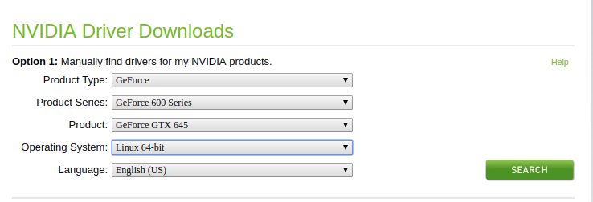

This is a step by step instructions for installing CUDA and cuDNN on Ubuntu Operating System.
Please Note: If you have a nvidia card only then proceed with this documents.
 
 ### Step 1: Download and Install NVIDIA card
 Go the following page
 ```
 http://www.nvidia.com/Download/index.aspx?lang=en-us 
 ```
 Select the driver for your nvidia graphics card. In the image below, I am selecting GTX 645 card for Linux 
 operating system.
  
 
### Step 2: Download CUDA ToolKit
Please note that this installation is for CUDA 8.0.
Download CUDA from the following link
```
https://developer.nvidia.com/cuda-80-ga2-download-archive
```
Select the option shown in the image below
 

### Step 3: Install CUDA Toolkit
```
# Go to the download directory. I am assuming you downloaded in the Downloads directory.
cd ~/Downloads
sudo dpkg -i cuda-repo-ubuntu1604-8-0-local-ga2_8.0.61-1_amd64.deb
sudo apt-get update
sudo apt-get install cuda
```


### Step 4:Download cuDNN
To Download you have create an account with NVIDIA.
 ```
 # GO to the page
 https://developer.nvidia.com/rdp/cudnn-download
 ```
 It will ask for you to create an account. After creating an account to the page again and download cuDNN for
 CUDA 8.0. Name of the packages are 
 ```
 cuDNN v7.1.4 Runtime Library for Ubuntu16.04 (Deb)
 cuDNN v7.1.4 Developer Library for Ubuntu16.04 (Deb) 
 cuDNN v7.1.4 Code Samples and User Guide for Ubuntu16.04 (Deb)
 ```
 The Download page should look like this
 
 

### Step 5: Install cuDNN
```
#Install the runtime library, for example:
sudo dpkg -i libcudnn7_7.1.4.18-1+cuda8.0_amd64.deb
#Install the developer library, for example:
sudo dpkg -i libcudnn7-dev_7.1.4.18-1+cuda8.0_amd64.deb
#Install the code samples and the cuDNN Library User Guide, for example:
sudo dpkg -i libcudnn7-doc_7.1.4.18-1+cuda8.0_amd64.deb 
```