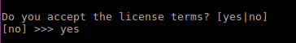

This is a step by step instructions for installing OpenCV3 on Ubuntu Operating System.
The steps are divided into sections for C++ and Python.
Note: I will be using anaconda for Python environment. If you don't know what anaconda is, dont worry about it

### Step 1. Update packages
```
sudo apt-get update
sudo apt-get upgrade
```
### Step 2: Install OS libraries
```
# Remove any previous installations of x264</h3>
sudo apt-get remove x264 libx264-dev

# We will Install dependencies now

sudo apt-get install build-essential checkinstall cmake pkg-config yasm -y
sudo apt-get install git gfortran -y
sudo apt-get install libjpeg8-dev libjasper-dev libpng12-dev -y

# If you are using Ubuntu 14.04
sudo apt-get install libtiff4-dev -y
# If you are using Ubuntu 16.04
sudo apt-get install libtiff5-dev -y

sudo apt-get install libavcodec-dev libavformat-dev libswscale-dev libdc1394-22-dev -y
sudo apt-get install libxine2-dev libv4l-dev -y
sudo apt-get install libgstreamer0.10-dev libgstreamer-plugins-base0.10-dev -y
sudo apt-get install qt5-default libgtk2.0-dev libtbb-dev -y
sudo apt-get install libatlas-base-dev -y
sudo apt-get install libfaac-dev libmp3lame-dev libtheora-dev -y
sudo apt-get install libvorbis-dev libxvidcore-dev -y
sudo apt-get install libopencore-amrnb-dev libopencore-amrwb-dev -y
sudo apt-get install x264 v4l-utils -y
sudo apt-get install wget -y

# Optional dependencies
sudo apt-get install libprotobuf-dev protobuf-compiler -y
sudo apt-get install libgoogle-glog-dev libgflags-dev -y
sudo apt-get install libgphoto2-dev libeigen3-dev libhdf5-dev doxygen -y
```

### Step 3: Install anaconda
```
# Change directory where you download anaconda
cd ~/Downloads

# Download Anaconda3  
# If you are copy pasting the command below, please note you will be downloading veriosn 3.5.2.
wget http://repo.continuum.io/archive/Anaconda3-5.2.0-Linux-x86_64.sh

# Change permision to make download file executable
chmod +x Anaconda3-5.2.0-Linux-x86_64.sh

# Run the script to install Anaconda and following the instructions. Recommended to keep setting to default.  
./Anaconda3-5.2.0-Linux-x86_64.sh
```
You will be faced with the following confusing question during anaconda3 installation but I got you covered. Just put the same answer as mine. If your questions are different,
do not worry and leave it default by pressing enter

Press enter to continue \


Type "yes" to accept the license\


Keep the default path by pressing enter. Believe me, it will make your life easy. \


Type "yes" to add anaconda3 installed location to PATH. \


Just type "no" \


### Step 4: Download OpenCV repository.

If you are copy pasting, Please note that you will be downloading version 3.3.1.
```
cd ~/Downloads
git clone https://github.com/opencv/opencv.git
cd opencv 
git checkout 3.3.1 
cd ..
```

### Step 5: Download OpenCV Contrib repository.
If you are copy pasting, Please note that you will be downloading version 3.3.1.
```
git clone https://github.com/opencv/opencv_contrib.git
cd opencv_contrib
git checkout 3.3.1
cd ..
```

### Step 6 Make build directory in OpenCV directory
```
cd opencv
mkdir build
cd build
```
 